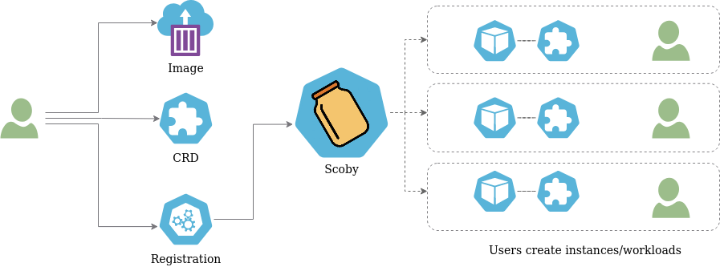

[](https://goreportcard.com/report/github.com/triggermesh/scoby)
[](https://github.com/triggermesh/scoby/releases)
[](https://join.slack.com/t/triggermesh-community/shared_invite/zt-1kngevosm-MY7kqn9h6bT08hWh8PeltA)

# `Scoby`: Generic Kubernetes Controllers

Scoby is a controller that creates controllers dynamically :infinity:, and makes it easy to manage your application instances as Kubernetes objects.

In a nutshell, Scoby is the shortest path between your application's container image and Kubernetes end users.



Given a container image containinng an application, a Kubernetes CRD that defines the application spec, and an Scoby registration that configures rendering, end users will be able to manage instances of your application at Kubernetes.

## Why?

We created Scoby to save (a lot of) time creating controllers for TriggerMesh, and letting users choose the set of TriggerMesh components that they want to use as well as easily creating custom components.

Read the full story [here](docs/why.md).

## Install

To install Scoby at a Kubernetes cluster apply manifests for both CRDs and Controller:

```console
# Install Scoby CRDs
kubectl apply -f https://github.com/triggermesh/scoby/releases/latest/download/scoby-crds.yaml

# Install Scoby Controller
kubectl apply -f https://github.com/triggermesh/scoby/releases/latest/download/scoby.yaml
```

Refer to [releases](https://github.com/triggermesh/scoby/releases) for further information.

### Development Version

Development version can be installed using [ko](https://github.com/ko-build/ko)

```console
ko apply -f ./config
```

## Docs

- [Primer: learn Scoby](docs/primer.md).
- [Tutorial: get the most out of Scoby](docs/tutorial.md).
- [Examples: migration TriggerMesh controllers](docs/triggermesh/README.md)
- Reference:
  - [Registration](docs/reference/registration.md).
  - [Status](docs/reference/status.md).
  - [Hooks](docs/reference/hooks.md) (:warning: preview :warning:)

## Contributing

We would be extremely happy to see you contributing to Scoby. Please refer to our [guidelines for contributors](docs/contributing.md).

## Commercial Support

TriggerMesh Inc. offers commercial support for the TriggerMesh platform. Email us at <info@triggermesh.com> to get more
details.

## License

This software is licensed under the [Apache License, Version 2.0][asl2].

Additionally, the End User License Agreement included in the [`EULA.pdf`](EULA.pdf) file applies to compiled
executables and container images released by TriggerMesh Inc.

[asl2]: https://www.apache.org/licenses/LICENSE-2.0
