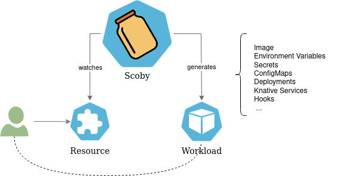
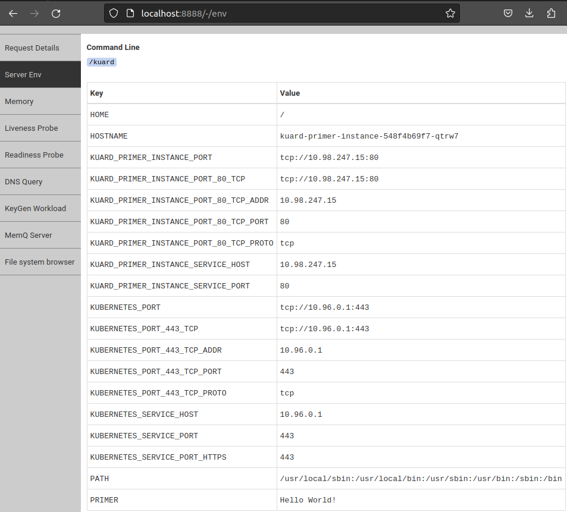

[](https://goreportcard.com/report/github.com/triggermesh/scoby)
[](https://github.com/triggermesh/scoby/releases)
[](https://join.slack.com/t/triggermesh-community/shared_invite/zt-1kngevosm-MY7kqn9h6bT08hWh8PeltA)

# `Scoby`: Generic Kubernetes Controllers


> photo by [Harrison Kugler](https://unsplash.com/@harrisonkugler?utm_source=unsplash&utm_medium=referral&utm_content=creditCopyText)

## Why?

We created Scoby to save (a lot of) time creating controllers for TriggerMesh, and letting users choose the set of TriggerMesh components that they want to use as well as easily creating custom components.

Read the full story [here](docs/why.md).

## Description

Scoby is a controller that creates controllers dynamically :infinity:, and makes it easy to manage your application instances as Kubernetes objects.

In a nutshell, Scoby is the shortest path between your application's container image and Kubernetes end users.


Given a container image containinng an application, a Kubernetes CRD that defines the application spec, and an Scoby registration that configures rendering, end users will be able to manage instances of your application at Kubernetes.

## Install

To install Scoby at a Kubernetes cluster apply manifests for both CRDs and Controller:

```console
# Install Scoby CRDs
kubectl apply -f https://github.com/triggermesh/scoby/releases/latest/download/scoby-crds.yaml

# Install Scoby Controller
kubectl apply -f https://github.com/triggermesh/scoby/releases/latest/download/scoby.yaml
```

Refer to [releases](https://github.com/triggermesh/scoby/releases) for further information.

### Development Version

Development version can be installed using [ko](https://github.com/ko-build/ko)

```console
ko apply -f ./config
```

## Primer

In this primer we are setting up the minimal registration to start using Scoby and allow Kubernetes users to create instances of your example application.

There are 4 requirements to configure an application at Scoby:

- Container image.
- Custom Resource Definition file (CRD).
- ClusterRoles on the CRD to allow Scoby to manage it.
- CRD Registration for Scoby.

### Kuard Image

We need a container image that Scoby can use, and that will receive parameters via environment variables.

In this primer (and at some other samples) we are using the [Kuard application](https://github.com/kubernetes-up-and-running/kuard) image which was created by the authors of Kubernetes Up and Ready book, and runs a web server that enables us to inspect the environment variables configured.

The image is available at `gcr.io/kuar-demo/kuard-amd64:blue`

### Kuard CRD

Kubernetes can serve third party objects using [CRDs](https://kubernetes.io/docs/tasks/extend-kubernetes/custom-resources/custom-resource-definitions/).

Scoby users need to create a CRD schema containing the fields that Kubernetes end users will provide to create new instances of the chosen container image.

By default each CRD schema field will generate an environment variable at the container, but rendering can be highly customized.

```yaml
apiVersion: apiextensions.k8s.io/v1
kind: CustomResourceDefinition
metadata:
  name: kuards.extensions.triggermesh.io
spec:
  group: extensions.triggermesh.io
  scope: Namespaced
  names:
    plural: kuards
    singular: kuard
    kind: Kuard
  versions:
    - name: v1
      served: true
      storage: true
      schema:
        openAPIV3Schema:
          type: object
          properties:
            spec:
              type: object
              properties:
                # Primer Scoby sample variable
                primer:
                  type: string
```

The CRD above defines a `kuard` resource with an schema that lets users define a value for `spec.primer` as a string. It lacks validations, complex structures and status but is still good to get to know Scoby.

```console
kubectl apply -f https://raw.githubusercontent.com/triggermesh/scoby/main/docs/samples/00.primer/01.kuard-crd.yaml
```

### Kuard ClusterRole

Since the CRD has been created at the previous step, the `kuard` resource is available and we can run a command to list the instances at the cluster:

```console
$ kubectl get kuards

No resources found in default namespace.
```

Not all users can manage resources though, `ServiceAccount` that need it must be granted roles on the new resource. One of those `ServiceAccount` is the one that runs Scoby, that will need to watch any changes at `kuard` instances at every namespace of the cluster and update the status (when the CRD contains the status element).

Scoby's `ServiceAccount` uses an aggregation pattern where any `ClusterRole` that contains the label `scoby.triggermesh.io/crdregistration: "true"` will be automatically granted.

```yaml
kind: ClusterRole
apiVersion: rbac.authorization.k8s.io/v1
metadata:
  name: crd-registrations-scoby-kuard
  labels:
    scoby.triggermesh.io/crdregistration: "true"
rules:
- apiGroups:
  - extensions.triggermesh.io
  resources:
  - kuards
  verbs:
  - get
  - list
  - watch
```

The `ClusterRole` above grants `get, list, watch` on `kuards` to the Scoby controller. It will be able to watch every change and retreive its data. Since for the sake of simplicity `kuard` CRD does not define a status subresource, we don't need to add a grant to update `kuards/status`.

```console
kubectl apply -f https://raw.githubusercontent.com/triggermesh/scoby/main/docs/samples/00.primer/02.kuard-clusterrole.yaml
```

Some of your Kuberbetes end users might want to manage `kuard` instances. That is something you will need to grant using `Role` or `ClusterRole` plus `RoleBinding` or `ClusterRoleBinding` on your users `ServiceAccount`.

### Kuard CRD Registration

Scoby is aware of the objects it needs to control through `CRDRegistration`. The registration contains informmation about the CRD, the workload that should exist for each instance created by users, the container image to use, environment variables customization, status management and hooks that might need to be called for each reconciliation cycle.

For this primer the registration look as simple as this:

```yaml
apiVersion: scoby.triggermesh.io/v1alpha1
kind: CRDRegistration
metadata:
  name: kuards
spec:
  crd: kuards.extensions.triggermesh.io
  workload:
    fromImage:
      repo: gcr.io/kuar-demo/kuard-amd64:blue
    formFactor:
      deployment:
        replicas: 1
        service:
          port: 80
          targetPort: 8080
```

We only provided the CRD and the container image to be used and the rendering form factor for each instance of `kuard` created by users, a deployment will be created that uses the provided image and an environment variable after each element under the instance's `.spec`. Kuard exposes a web server which is targetted by a Kubernetes service also defined at the form factor.

```console
kubectl apply -f https://raw.githubusercontent.com/triggermesh/scoby/main/docs/samples/00.primer/03.kuard-registration.yaml
```

Scoby is now listening for `kuards`, you can check the status of registrations.

```console
$ kubectl get crdregistrations.scoby.triggermesh.io

NAME     CRD                                READY
kuards   kuards.extensions.triggermesh.io   True
```

### Creating Kuard Instances

As an end user, and as long as the user `ServiceAccount` has been granted permissions, we are able now to create `kuard` instances that comply with the CRD schema. Scoby will act on instances and ensure that the form factor defined at the registration is satisfied.



Users can now create `kuards` like this one:

```yaml
apiVersion: extensions.triggermesh.io/v1
kind: Kuard
metadata:
  name: kuard-primer-instance
spec:
  primer: Hello World!
```

```console
kubectl apply -f https://raw.githubusercontent.com/triggermesh/scoby/main/docs/samples/00.primer/04.kuard-instance.yaml
```

The instance will generate a deployment and a service.

```console
$ kubectl get deployment,svc
NAME                                    READY   UP-TO-DATE   AVAILABLE   AGE
deployment.apps/kuard-primer-instance   1/1     1            1           1m00s

NAME                            TYPE        CLUSTER-IP     EXTERNAL-IP   PORT(S)   AGE
service/kuard-primer-instance   ClusterIP   10.98.247.15   <none>        80/TCP    1m00s
```

The service can be forwarded to be able to reach `kuard` using `http://localhost:8888`.

```console
kubectl port-forward svc/kuard-primer-instance  8888:80
```

Open the URL and navigate to `Server Env` option at the vertical menu. You should find that the `.spec.primer` element at the spec has been reflected as `PRIMER` environment variable at the running pod.



Without requiring any coding, Kubernetes users can now create `kuard` instances at their namespaces and Scoby will reconcile them through their lifecycle.

This primer example does not contain status management though, which means that we needed to discover the exposed URL by ourselves, we had no information about whether the deployment was ready or not, the parameters did not undergo any transformation, and there was no hooks customization. All those features enrich Scoby capabilities and provide better end user experience.

### Clean Up

Remove assets created, preferably in reverse creation order to avoid getting error logs at Scoby controller.

```console
kubectl delete kuards kuard-primer-instance
kubectl delete crdregistrations.scoby.triggermesh.io kuards
kubectl delete clusterroles crd-registrations-scoby-kuard
kubectl delete crd kuards.extensions.triggermesh.io
```

## Recommendations

After following the [primer example](#primer) we can start generalizing usage, starting with a set of facts:

- Any image can be registered at Scoby
- Any CRD can be registered at Scoby.
- If the CRD status subresource exists and adheres to a recommended structure it will report accurate status information when reconciled.
- The registration objects are Scoby configuration assets.
- Registration object reconciliations can be extended by hooks.

Our recommended approach to use Scoby is:

- When developing your application and creating the container images, make sure you follow the 12 factor application methodology, specifically the [configuration](https://12factor.net/config) section that recommends using envrionment variables as application parameters.

- If will be useful to read :bookmark_tabs: [Scoby Registrations documentation](docs/registration.md) and make sure that environment variables names will be aligned with the CRD spec, hence the Scoby Registration looking simpler.

- Refer to [Kubernetes documentation](https://kubernetes.io/docs/tasks/extend-kubernetes/custom-resources/custom-resource-definitions/) for creating CRDs. We encourage you to follow :bookmark_tabs: [these status patterns](docs/status.md) when designing your custom objects. Upon registration Scoby will inspect the CRD status subresource searching for those patterns and when found, will be used to write object instances status.

- Scoby :bookmark_tabs: [CRD Registration](docs/registration.md) contains the core settings at `spec.workload`, which contains most of the configuration that you can do at an Scoby Registration. We recommend starting with the minimal information, that would be the container image to use and the form factor to render, check the results and transform environments variables iteratively.

- When users require functionality not built-in at Scoby, [Hooks](docs/hooks.md) can be used. They provide mechanisms to do custom reconciling, add environment variables to the workload and inform statuses. For security reasons they are not allowed to manage objects that are not part of Scoby's workload. :warning: Hooks are experimental :warning:

- Other than the documentation linked at the bullets above, we have put togheter a :computer_mouse: [getting started guide](docs/getting-started/README.md) that will get you through most of the rendering cases that Scoby supports.

- An example of [migrating a TriggerMesh component to Scoby](docs/triggermesh/README.md).

## Contributing

We would be extremely happy to see you contributing to Scoby. Please refer to our [guidelines for contributors](docs/contributing.md).

## Commercial Support

TriggerMesh Inc. offers commercial support for the TriggerMesh platform. Email us at <info@triggermesh.com> to get more
details.

## License

This software is licensed under the [Apache License, Version 2.0][asl2].

Additionally, the End User License Agreement included in the [`EULA.pdf`](EULA.pdf) file applies to compiled
executables and container images released by TriggerMesh Inc.

[asl2]: https://www.apache.org/licenses/LICENSE-2.0
