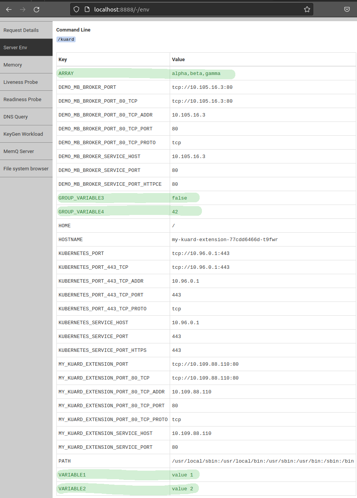

# Getting Started

In this guide we will use the Kuard application image which was created by the authors of Kubernetes Up and Ready book, and is able to render a list of its environment variables:

- [Kuard repository](https://github.com/kubernetes-up-and-running/kuard)
- Kuard image: gcr.io/kuar-demo/kuard-amd64:blue

A very generic playground [kuard CRD](../../docs/samples/01.kuard/01.kuard-crd.yaml) can be found at Scoby repo, containing combination of nested elements, arrays, object references and [full status support for Scoby](../status.md).

A flattened version of that CRD `spec` contents would look like this:

```text
spec.variable1
spec.variable2
spec.group.variable3
spec.group.variable4
spec.array[]
spec.reftoSecret.secretName
spec.reftoSecret.secretKey
spec.refToConfigMap.configName
spec.refToConfigMap.configKey
spec.refToAddress.uri
spec.refToAddress.ref.apiVersion
spec.refToAddress.ref.kind
spec.refToAddress.ref.name
spec.refToAddress.ref.namespace
```

## Initialization

For this guide we will create the CRD once, and use it with different registrations, resulting in different workloads settings for each of them:

```console
kubectl apply -f https://raw.githubusercontent.com/triggermesh/scoby/main/docs/samples/01.kuard/01.kuard-crd.yaml
```

The results of each registration at this guide can be check by port forwarding the generated workload and navigating kuard, or by inspecting the generated pod's environment variables.

- Navigating kuard: forward the generated service for a deployment. In the case of a Knative Serving service, use the external address to access the UI.

```console
kubectl port-forward svc/my-kuard-extension  8888:80
```

- Inspecting pod's environment variables: replace the pod name with the Scoby rendered pod.

```console
kubectl get po my-rendered-pod -ojsonpath='{.items[0].spec.containers[0].env}' | jq .
```

We will stick to the pod inspecting method but for the first example, where we will use both.

**Important Note**: Due to limitations at controller-runtime, and the fact that we are re-registering the same CRD at every test, the controller needs to be re-started before each of the example entries in this guide.

### Deployment Registration

The deployment registration is going to be used for most examples at this guide due to not requiring any added software compared with the Knative Service registration. The form factor at this example is configured to create one pod and a service that listens on 80 and forward requests to the pod's 8080, where the kuard application is listening:

```yaml
apiVersion: scoby.triggermesh.io/v1alpha1
kind: CRDRegistration
metadata:
  name: kuard
spec:
  crd: kuards.extensions.triggermesh.io
  workload:
    formFactor:
      deployment:
        replicas: 1
        service:
          port: 80
          targetPort: 8080
    fromImage:
      repo: gcr.io/kuar-demo/kuard-amd64:blue
```

You can also find in the YAML snippet above the reference to the CRD and image that will remain constant throughout all examples.

Create the registration:

```console
kubectl apply -f https://raw.githubusercontent.com/triggermesh/scoby/main/docs/samples/01.kuard/01.deployment/01.kuard-registration.yaml
```

Scoby spins up a controller that will manage `kuard01` objects. Let's create an instance, and to get started with the default rendering behavior, let's fill some elements in it:

```yaml
apiVersion: extensions.triggermesh.io/v1
kind: Kuard
metadata:
  name: my-kuard-extension
spec:
  variable1: value 1
  variable2: value 2
  group:
    variable3: false
    variable4: 42
  array:
  - alpha
  - beta
  - gamma
```

The spec above matches a subset of the CRD structure. Only these fields will be converted into environment variables when applied.

```console
kubectl apply -f https://raw.githubusercontent.com/triggermesh/scoby/main/docs/samples/01.kuard/01.deployment/02.kuard-instance.yaml
```

A deployment and a service must have been generated:

```console
kubectl get deployment,svc -l app.kubernetes.io/name=kuard
```

Retrieve the pod's environment variables.
Note: using the label selector return a list, we expect a single pod to match it at `items[0]`:

```console
kubectl get po -l app.kubernetes.io/name=kuard -ojsonpath='{.items[0].spec.containers[0].env}' | jq .
```

The result shows Scoby rendering each informed element as environment variables whose name is a capitalized concatenation of the element hierarchy:

```json
[
  {
    "name": "ARRAY",
    "value": "alpha,beta,gamma"
  },
  {
    "name": "GROUP_VARIABLE3",
    "value": "false"
  },
  {
    "name": "GROUP_VARIABLE4",
    "value": "42"
  },
  {
    "name": "VARIABLE1",
    "value": "value 1"
  },
  {
    "name": "VARIABLE2",
    "value": "value 2"
  }
]
```

Exploring kuard's interface we can also find these environment variables:

```console
kubectl port-forward svc/my-kuard-extension  8888:80
```



Let's remove the kuard instance and registration before proceeding with the next one:

```console
kubectl delete kuard my-kuard-extension
kubectl delete crdregistration kuard
```

This will remove the kuard instance and its generated components, and the Scoby registration.

### Knative Serving Registration

The Knative Service registration requires Knative Serving to be installed. Follow the [instructions at the Knative site](https://knative.dev/docs/install/) to install it. The form factor at this example is configured to create a public service that scales between 1 and 3 instances. You can set the `minScale` parameter to 0 to enable `scale to 0` feature:

```yaml
apiVersion: scoby.triggermesh.io/v1alpha1
kind: CRDRegistration
metadata:
  name: kuard
spec:
  crd: kuards.extensions.triggermesh.io
  workload:
    formFactor:
      knativeService:
        minScale: 1
        maxScale: 3
        visibility: public
    fromImage:
      repo: gcr.io/kuar-demo/kuard-amd64:blue
```

Create the registration:

```console
kubectl apply -f https://raw.githubusercontent.com/triggermesh/scoby/main/docs/samples/01.kuard/02.knative-service/01.kuard-registration.yaml
```

Now create the same kuard instance we created for the deployment registration:

```console
kubectl apply -f https://raw.githubusercontent.com/triggermesh/scoby/main/docs/samples/01.kuard/02.knative-service/02.kuard-instance.yaml
```

The service generates a pod whose environment variables can be inspected using a Knative Service version of the label filter that we used for the deployment:

```console
kubectl get po -l serving.knative.dev/service=my-kuard-extension -ojsonpath='{.items[0].spec.containers[0].env}' | jq .
```

You can find some Knative Serving variables being added, and the same Scoby variables we got at the Deployment form factor example.

```json
[
  {
    "name": "ARRAY",
    "value": "alpha,beta,gamma"
  },
  {
    "name": "GROUP_VARIABLE3",
    "value": "false"
  },
  {
    "name": "GROUP_VARIABLE4",
    "value": "42"
  },
  {
    "name": "VARIABLE1",
    "value": "value 1"
  },
  {
    "name": "VARIABLE2",
    "value": "value 2"
  },
  {
    "name": "PORT",
    "value": "8080"
  },
  {
    "name": "K_REVISION",
    "value": "my-kuard-extension-00001"
  },
  {
    "name": "K_CONFIGURATION",
    "value": "my-kuard-extension"
  },
  {
    "name": "K_SERVICE",
    "value": "my-kuard-extension"
  }
]
```

Let's clean up the example.

```console
kubectl delete kuard my-kuard-extension
kubectl delete crdregistration kuard
```

### Skip Parameter Rendering

When an element in the spec is not meant to generate an environment variable, the rendering can be skipped via a configuration parameter.

```yaml
apiVersion: scoby.triggermesh.io/v1alpha1
kind: CRDRegistration
metadata:
  name: kuard
spec:
  crd: kuards.extensions.triggermesh.io
  workload:
    formFactor:
      deployment:
        replicas: 1
        service:
          port: 80
          targetPort: 8080
    fromImage:
      repo: gcr.io/kuar-demo/kuard-amd64:blue
    parameterConfiguration:
      customize:
      # Skip variable2 from generating a parameter for the workload
      - path: spec.variable2
        render:
          skip: true

```

The `spec.workload.parameterConfiguration.customize[].render.skip` boolean indicates whether the environment variable for the element should be generated.

Create the registration:

```console
kubectl apply -f https://raw.githubusercontent.com/triggermesh/scoby/main/docs/samples/01.kuard/03.param.skip/01.kuard-registration.yaml
```

Create the same instance we have created so far:

```console
kubectl apply -f https://raw.githubusercontent.com/triggermesh/scoby/main/docs/samples/01.kuard/03.param.skip/02.kuard-instance.yaml
```

Inspect generated environment variables:

```console
kubectl get po -l app.kubernetes.io/name=kuard -ojsonpath='{.items[0].spec.containers[0].env}' | jq .
```

Look at the result:

```json
[
  {
    "name": "ARRAY",
    "value": "alpha,beta,gamma"
  },
  {
    "name": "GROUP_VARIABLE3",
    "value": "false"
  },
  {
    "name": "GROUP_VARIABLE4",
    "value": "42"
  },
  {
    "name": "VARIABLE1",
    "value": "value 1"
  }
]
```

Rendering skipped `.spec.variable2` rendering.
Clean up the example:

```console
kubectl delete kuard my-kuard-extension
kubectl delete crdregistration kuard
```

### Parameter Renaming

Most often expected environment variables at the container do not match Scoby's automatic rendering. All generated environment variables can be renamed using ``spec.workload.parameterConfiguration.customize[].render.key`.

```yaml
apiVersion: scoby.triggermesh.io/v1alpha1
kind: CRDRegistration
metadata:
  name: kuard
spec:
  crd: kuards.extensions.triggermesh.io
  workload:
    formFactor:
      deployment:
        replicas: 1
        service:
          port: 80
          targetPort: 8080
    fromImage:
      repo: gcr.io/kuar-demo/kuard-amd64:blue
    parameterConfiguration:
      customize:
      # Skip variable2 from generating a parameter for the workload
      - path: spec.variable2
        render:
          key: KUARD_VARIABLE_TWO
```

Create the registration:

```console
kubectl apply -f https://raw.githubusercontent.com/triggermesh/scoby/main/docs/samples/01.kuard/04.param.rename/01.kuard-registration.yaml
```

Create the same instance we have created so far:

```console
kubectl apply -f https://raw.githubusercontent.com/triggermesh/scoby/main/docs/samples/01.kuard/04.param.rename/02.kuard-instance.yaml
```

Inspect generated environment variables:

```console
kubectl get po -l app.kubernetes.io/name=kuard -ojsonpath='{.items[0].spec.containers[0].env}' | jq .
```

Look at the result:

```json
[
  {
    "name": "ARRAY",
    "value": "alpha,beta,gamma"
  },
  {
    "name": "GROUP_VARIABLE3",
    "value": "false"
  },
  {
    "name": "GROUP_VARIABLE4",
    "value": "42"
  },
  {
    "name": "VARIABLE1",
    "value": "value 1"
  },
  {
    "name": "KUARD_VARIABLE_TWO",
    "value": "value 2"
  }
]
```

Note the variable at `.spec.variable2` renamed as `KUARD_VARIABLE_TWO`.
Clean up the example:

```console
kubectl delete kuard my-kuard-extension
kubectl delete crdregistration kuard
```

## Clean Up

Remove the registered CRD. Note: the controller is still not able to remove informers, logs will complain about the CRD not being present. This can only be solved at the moment restarting the controller.

```console
kubectl delete crd kuards.extensions.triggermesh.io
```
